
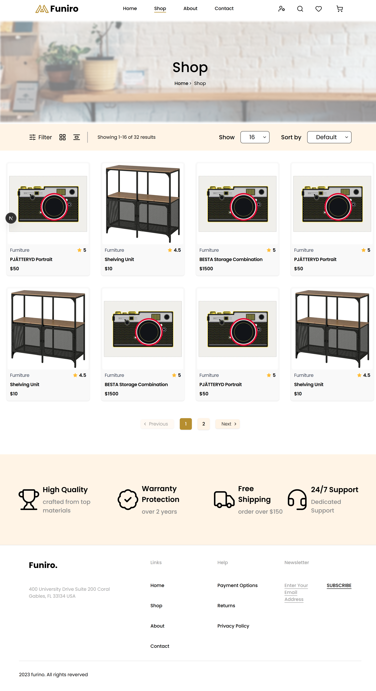

<div align="center">

# E-commerce Website

**A furniture store website**


<div align="center">
  
  
</div>

</div>

---

## Overview

**E-commerce Furniture Website** This website provides the users with a smooth user experience through every step to purchase their furniture all the way from browsing through the products, comparing products by their materials, sizes, description and prices, adding the products they like to their carts and finally to checking out the products.

---

## Getting Started

### Prerequisites

- **Node.js** 22 LTS (or 20.19+). The toolchain (Vite 8, ESLint 10, TypeScript 6) requires a recent Node version.
- **npm** 10+
- **Git**

### Installation

```bash
# 1. Clone the repository
git clone https://github.com/SheroukHesham/e-commerce-nextjs
cd e-commerce-nextjs

# 2. Install dependencies
npm install
```

### Run in development

```bash
npm run dev
```

This starts the Vite dev server (`http://localhost:5123`).

### Start Your Strapi Server

```bash
npm run develop
```

This starts Strapi server(`http://localhost:1337`).

---

## License and Author

Private project, all rights reserved.

Built by **Sherouk**.
